# ColddBox: Easy

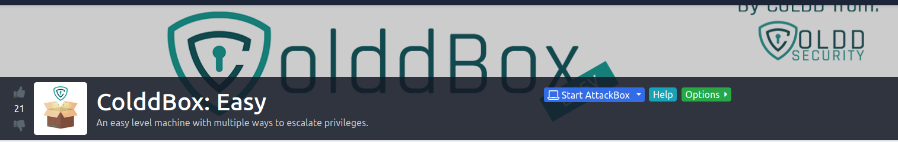

Room : https://tryhackme.com/room/colddboxeasy

`security` `box` `privesc` `wordpress`

Author : [@martinfriasc](https://twitter.com/martinfriasc)

## Reconnaissance:

Let's start with `nmap` scan.

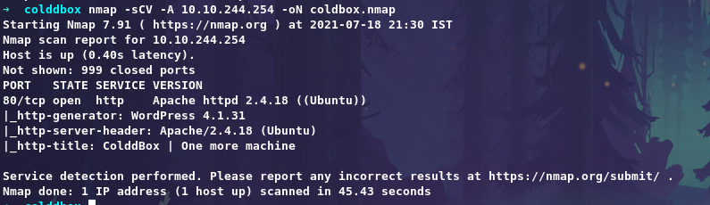

Only port 80 is open lets's check it.

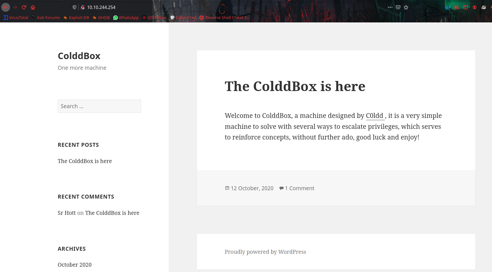

We can see server is running `wordpress` with an old version `4.1.31`.

## Enumeration

From `Gobuster` result we get directory called `/hidden`

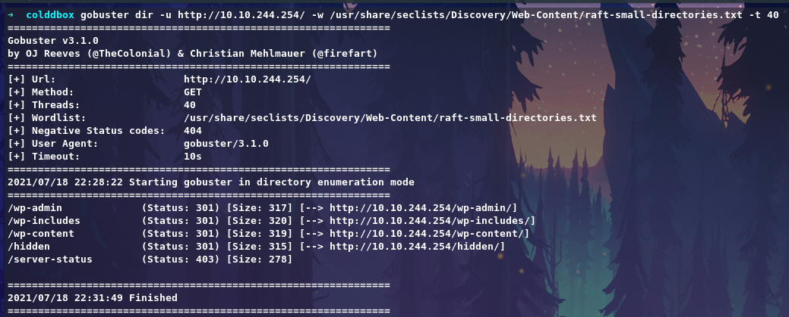
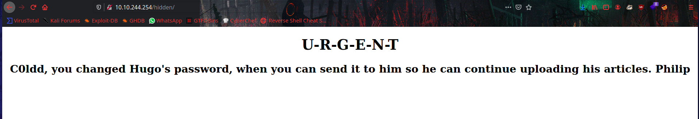

From the directory we get some usernames maybe.
Let's run the `wpscan`

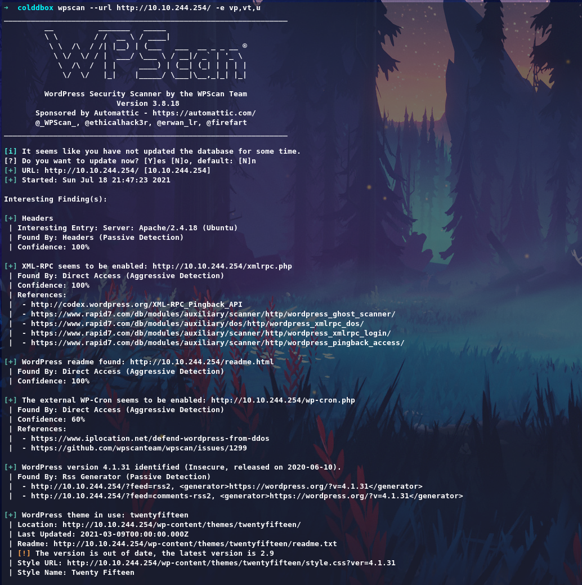
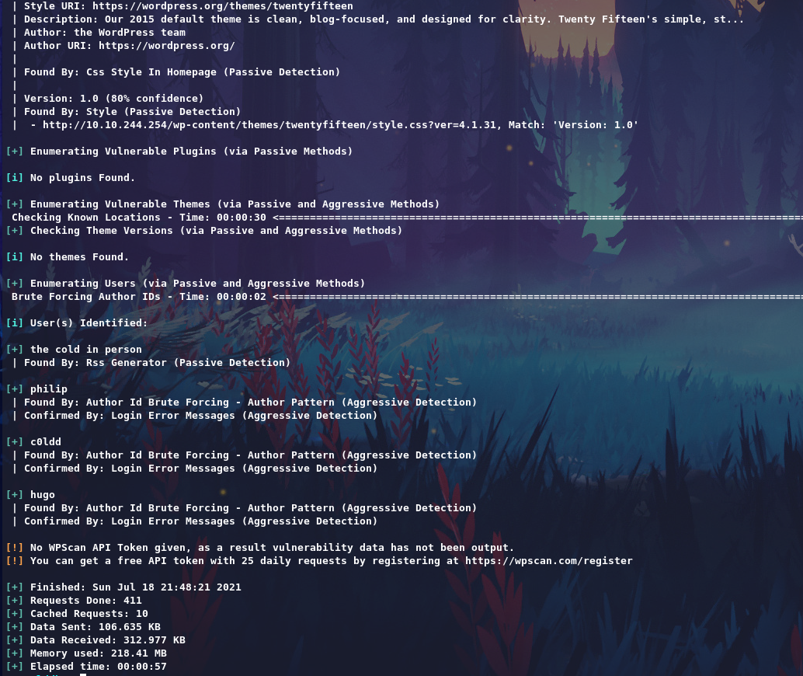

So users confirmed, Give a try login with bruteforce method.

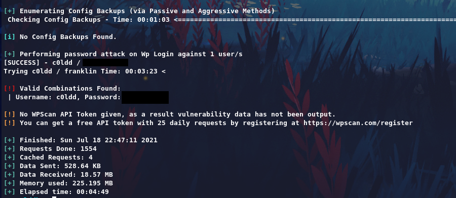

We get Username:Password, let's login via `/wp-login.php`

And add php-reverse shell on `404 Template` and call it.

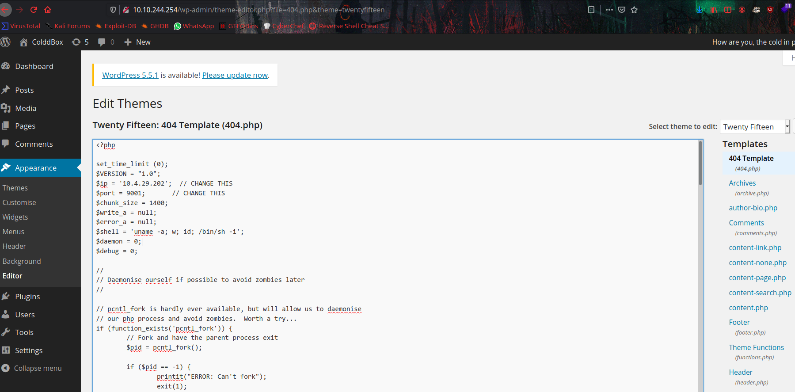
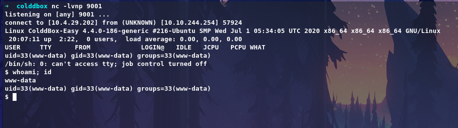

It's a wordpress server so let's check for `/wp-config.php` file to get credentials.

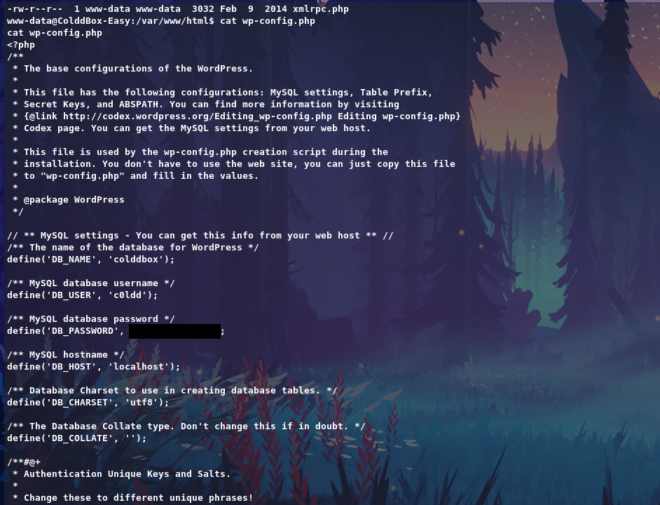

Now we can Switch user to `c0ldd` and get user flag.

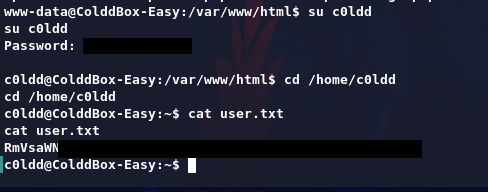

## Privilege Escalation:

Running `sudo -l` we see that we can run some certain binaries as the root user.

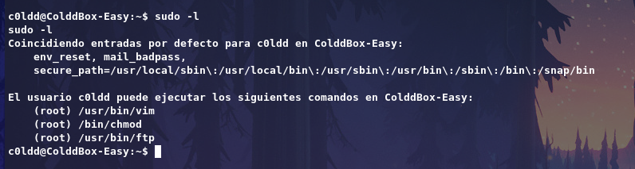

Here iam using `chmod` which will changes permission of a binary file or executable,

Add a SUID bit on bash and get a root shell that way `sudo chmod +s /bin/bash`

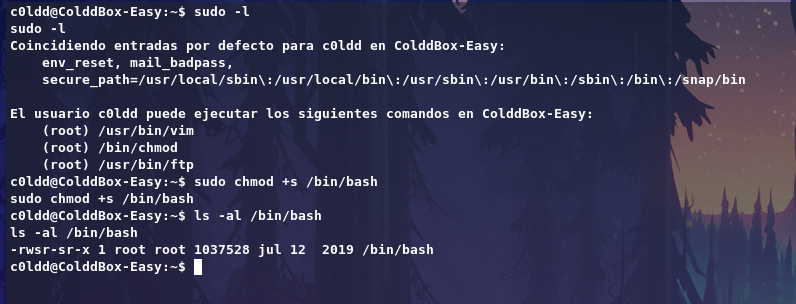

Now run `/bin/bash -p` to get root shell

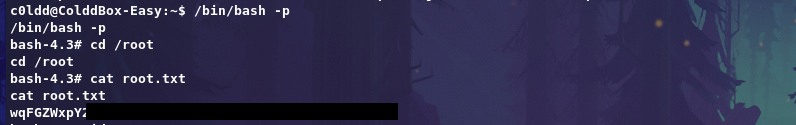

## Thank you for reading my writeup!
