# Smag Grotto


Room : https://tryhackme.com/room/smaggrotto

`wireshark` `privesc`

Author : [@jakeyee](https://tryhackme.com/p/jakeyee)

## Reconnaissance:

Let's start with `nmap` scan.

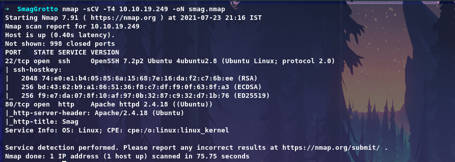

Discoverd 2 Ports, Let's check port 80.

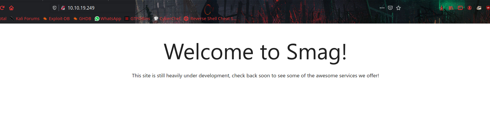

## Enumeration:

From `gobuster` result we will get directory called `/main`

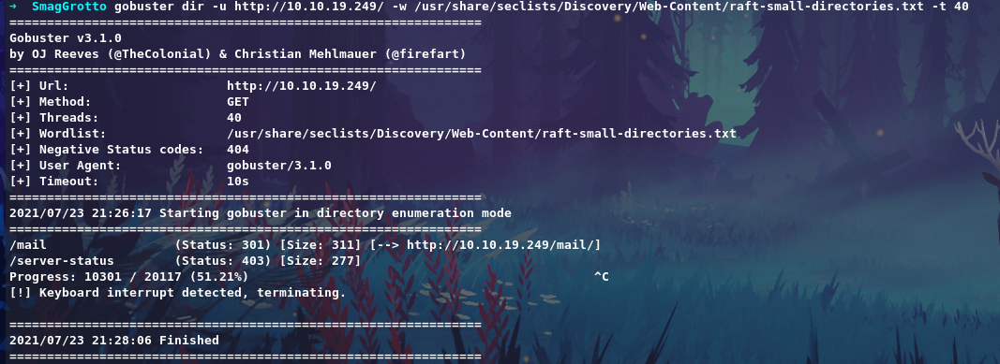

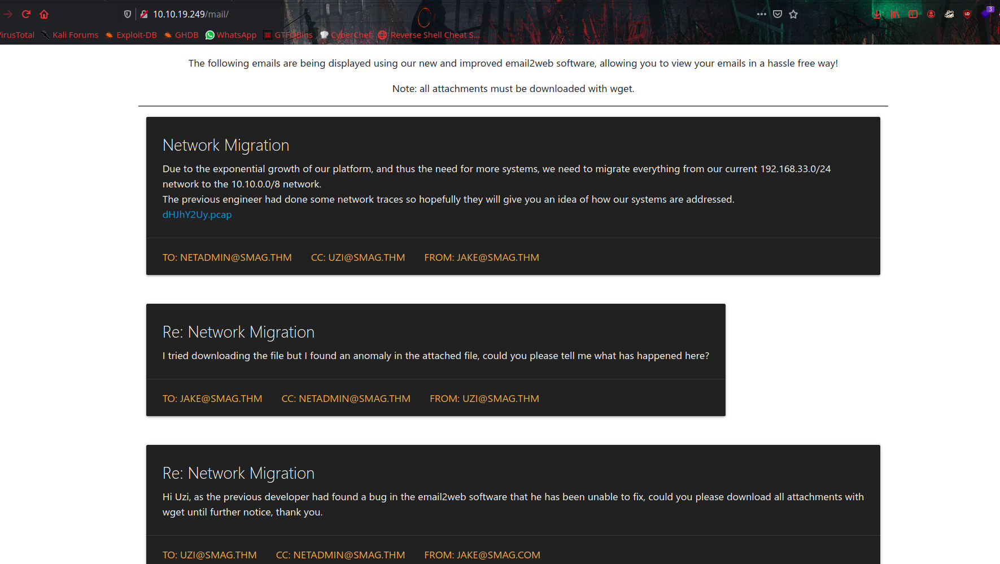

It has a `pcap` file to download, let's analize it with `wireshark`.

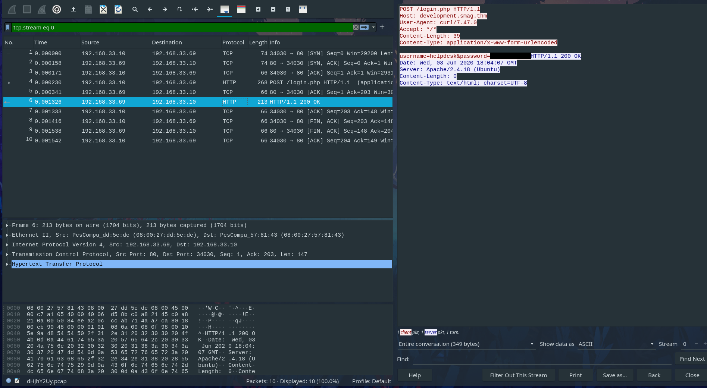

Taking good look at it, We can find HTTP POST request to `development.smag.thm/login.php` and also username and password that used to login on clear text.

Now add `development.smag.thm` to our `/etc/hosts` file.

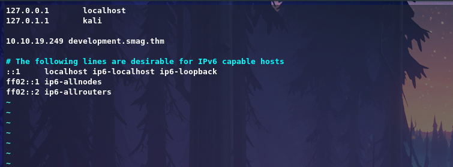

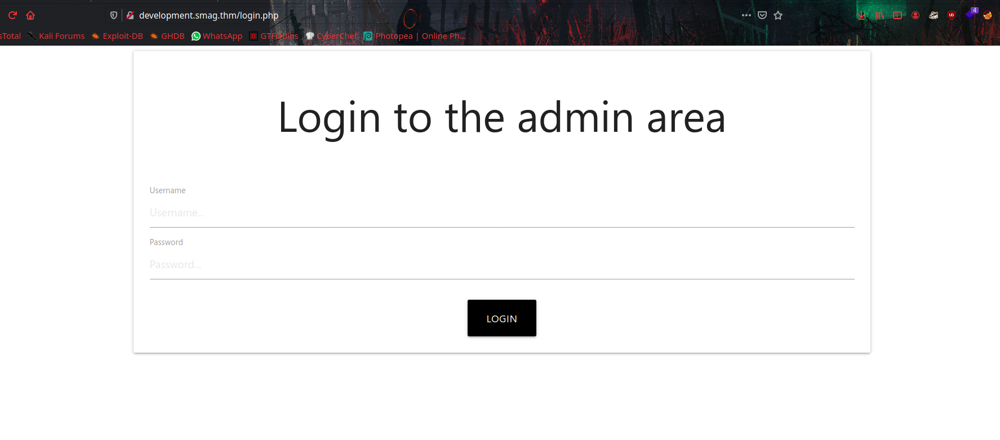

There is a login portal, So now we can login with credentials we found on `.pcap` file. and it will redirect to `/admin.php`.

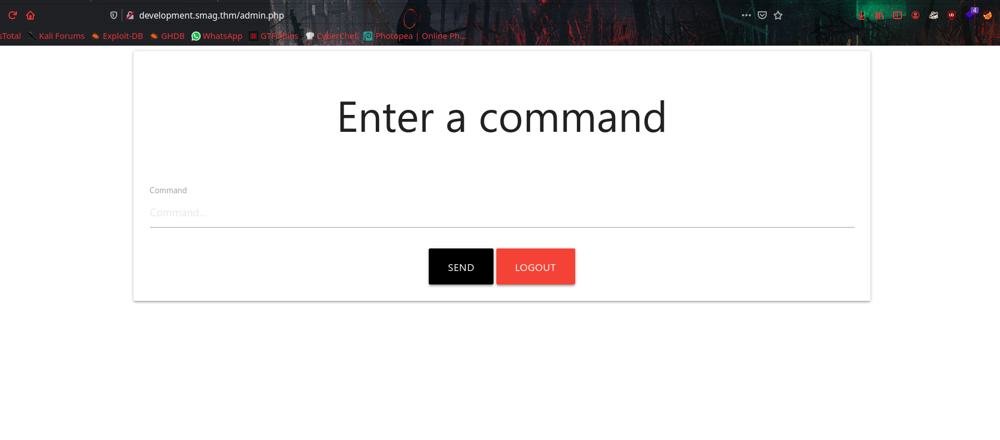

its a webshell, So let's input [reverse shell](https://www.revshells.com/) command to get reverse connection.

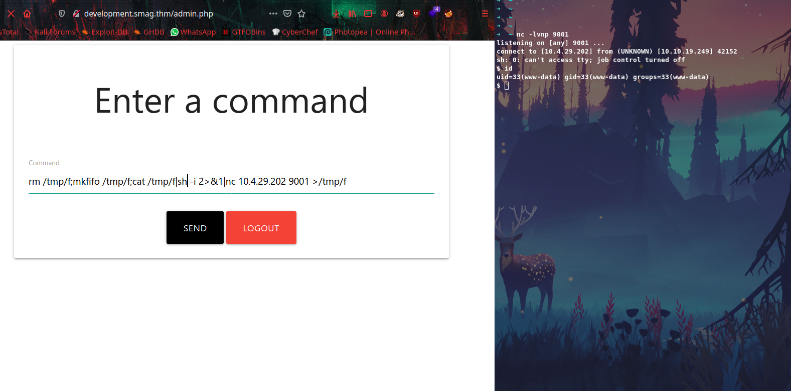

Spawn a python shell using ; `python3 -c 'import pty;pty.spawn("/bin/bash")'` 

Enumerating further more we can see interesting job running on `/etc/crontab`

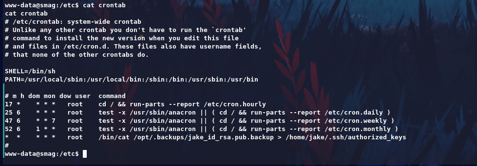

Here we can manipulate that get user privilege.

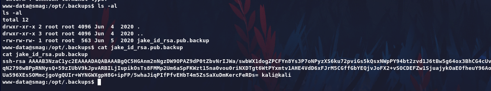

We have write permission, So we can add our public key to `/opt/.backups/jake_id_rsa.pub.backup` get User jake.

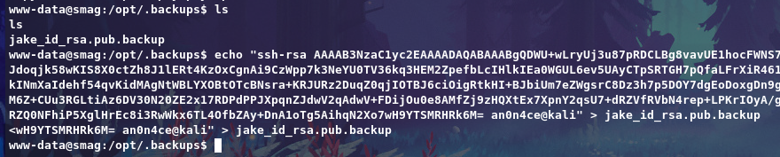

Now we can login via `SSH` to user `jake` without password.

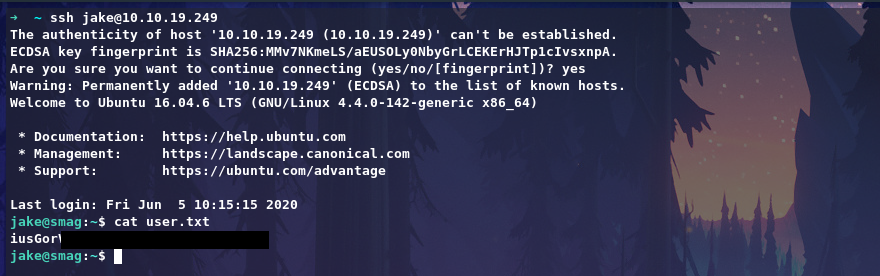

## Privilege Escalation:

Let's check sudo privilege for `jake` with command `sudo -l`

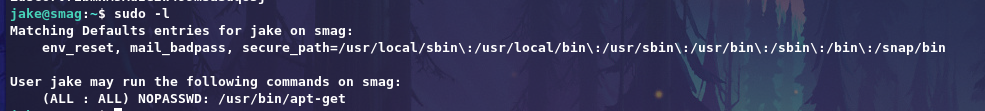

Now get exploit on [GTFObins](https://gtfobins.github.io/gtfobins/apt-get/) for `/usr/bin/apt-get` to get root shell.
```
sudo apt-get update -o APT::Update::Pre-Invoke::=/bin/sh
```
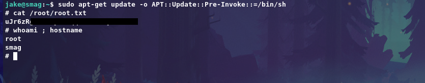
